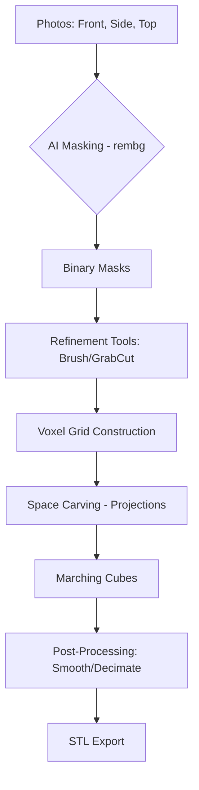

# Image23DPrint 📸 ➡️ 🧊

**Image23DPrint** is a professional-grade 3D reconstruction tool that transforms 2D photographs into print-ready 3D models (STL) using advanced **Space Carving** (Voxel Carving) algorithms and AI-powered background removal.

Designed for hobbyists, engineers, and creators, it allows you to generate a 3D model from as few as three photos (Front, Side, Top) with precise real-world scaling.

---

## ✨ Key Features

- 🧠 **AI-Powered Masking**: Utilizes `rembg` (ISNet) to automatically isolate objects from complex backgrounds.
- 🤖 **Local LLM Vision Analysis**: Optional Ollama integration provides intelligent photo analysis, orientation detection, and quality warnings—all running locally for complete privacy.
- 📐 **Precision Scaling**: Built-in calibration tool to set real-world dimensions (mm) from a simple reference line.
- 🖼️ **2D-to-Thin-3D**: Instantly generate a constant-thickness 3D layer from a single image (perfect for signs and lithophanes).
- 🖥️ **Interactive Refinement**: Manual brush tools, "Edge Mask" (Canny), "Smart Outline" (GrabCut), and morphological refinement to perfect your masks.
- 🧊 **Proportional Carving**: Supports non-cubic voxel grids to ensure tall or wide objects aren't distorted.
- ⚡ **Optimized Mesh**: Automatic Laplacian smoothing and Quadric Decimation for clean, lightweight STL files.
- 🖨️ **Print Ready**: Auto-bed alignment ensures the generated model's base sits perfectly at Z=0.

---

## 🚀 Quick Start

### 1. Installation
Ensure you have Python 3.13+ and `uv` (recommended) or `pip` installed.

```bash
# Clone the repository
git clone https://github.com/flippinhutt/image23dprint.git
cd image23dprint

# Install dependencies
uv sync
```

### 2. Launch
```bash
PYTHONPATH=src uv run python -m image23dprint
```

### 3. Usage
1. **Load Images**: Click the three boxes to load **Front**, **Side**, and **Top** photos of your object.
2. **AI Mask**: Click **AI Auto-Mask** to let the vision model isolate the object.
3. **Calibrate**: Use the **Scale Tool** to draw a line on an object (e.g., its height) and input the real-world mm.
4. **Generate**: Set your desired resolution (32-256) and click **Generate STL**.
5. **Export**: Preview the 3D model and click **Export** to save your print-ready file.

---

## 🤖 Ollama Integration

**Image23DPrint** supports optional AI-powered photo analysis via [Ollama](https://ollama.ai), a local LLM runtime. When enabled, the app provides intelligent feedback on your photos before you start carving—helping you catch quality issues early and optimize your results.

### ✨ Features
- 🎯 **Automatic Orientation Detection**: Identifies if your photo is a front, side, or top view with confidence scoring
- ⚠️ **Quality Warnings**: Detects common issues like blur, reflections, low contrast, and transparency
- 💬 **Natural Language Guidance**: Provides conversational suggestions for improving your photos
- 🔒 **100% Local Processing**: All analysis runs on your machine—no data ever leaves your computer

### 📦 Setup (Optional)

Ollama integration is **completely optional**. The app works perfectly without it—this feature simply adds intelligent assistance when available.

1. **Install Ollama**
   Download and install from [ollama.ai](https://ollama.ai)

2. **Pull the Vision Model**
   ```bash
   ollama pull llava
   ```

3. **Start Ollama** (if not auto-started)
   ```bash
   ollama serve
   ```

4. **Launch Image23DPrint**
   The app will automatically detect Ollama and enable AI analysis features.

### 🚦 How It Works

- When you load an image, the app automatically analyzes it (if Ollama is running)
- Results appear in the **AI Analysis** panel with orientation suggestions and quality warnings
- If issues are detected (blur, reflections), the affected image gets a visual warning border
- Click **Analyze with AI** to manually re-run analysis on your loaded images

### 🛡️ Privacy & Offline Use

Unlike cloud-based AI tools, **all Ollama processing happens locally**. Your photos and designs never leave your machine, making this perfect for proprietary or sensitive projects.

---

## 🏗️ Architecture



---

## 🛠️ Technical Details

- **Language**: Python 3.13
- **UI Framework**: PySide6 (Qt)
- **Computer Vision**: OpenCV, rembg (ONNX)
- **3D Geometry**: trimesh, scikit-image (Marching Cubes)
- **Package Manager**: uv

---

## 📚 Documentation
- [Architecture](docs/architecture.md): Technical deep-dive into space carving.
- [API Reference](docs/API.md): Class and method documentation.
- [Governance](docs/governance.md): Contribution and review guidelines.
- [GitHub Actions](docs/github_actions.md): CI/CD pipeline details.

---

## 🗺️ Roadmap / TODO

We are actively developing and looking for contributors!
- [x] **Ollama Support**: Integrate local LLM vision for scene analysis and intelligent photo feedback.
- [ ] **Extended AI Support**: Support for additional vision models (Segment Anything, etc.).
- [ ] **Improved Image Recognition**: Enhanced edge detection for fine-grained object features.
- [x] **2D-to-Thin-3D**: Allow generating a 3D layer with adjustable thickness from a single 2D image.
- [ ] **Poisson Surface Reconstruction**: For perfectly watertight, high-poly 3D models.

---

## 🤝 Contributing
This is an active research project. Contributions are welcome!
1. Fork the repo.
2. Create your feature branch (`git checkout -b feature/AmazingFeature`).
3. Commit your changes (`git commit -m 'Add some AmazingFeature'`).
4. Push to the branch (`git push origin feature/AmazingFeature`).
5. Open a Pull Request.

---

## 📜 License
Distributed under the MIT License. See `LICENSE` for more information.

---
*Created with ❤️ by [flippinhutt](https://github.com/flippinhutt)*
